<p align="center">
  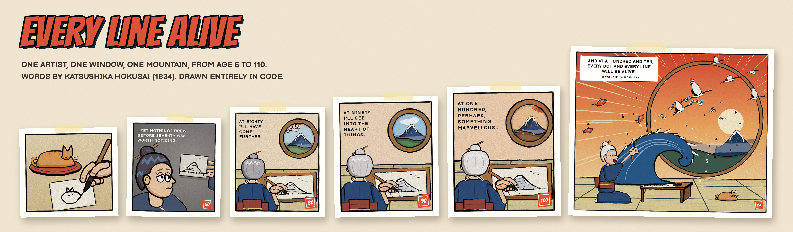
</p>

<p align="center">
  <b>Short inspirational comics in the style of <a href="https://www.zenpencils.com/">Zen Pencils</a>, drawn entirely by code.</b><br>
  No image assets, no tracing, no generative models: every line, colour and letter is placed by JavaScript.
</p>

---

## Every Line Alive

> *From the age of six I had a mania for drawing the shapes of things. … And at a hundred and ten, every
> dot and every line will be alive.*
> Katsushika Hokusai, 1834

One artist, one round window, one mountain, drawn again and again from age 6 to 110. The drawing on her
desk is generated with a `skill` parameter, so it really does get better as she ages, until at 110 the
wave leaves the paper.

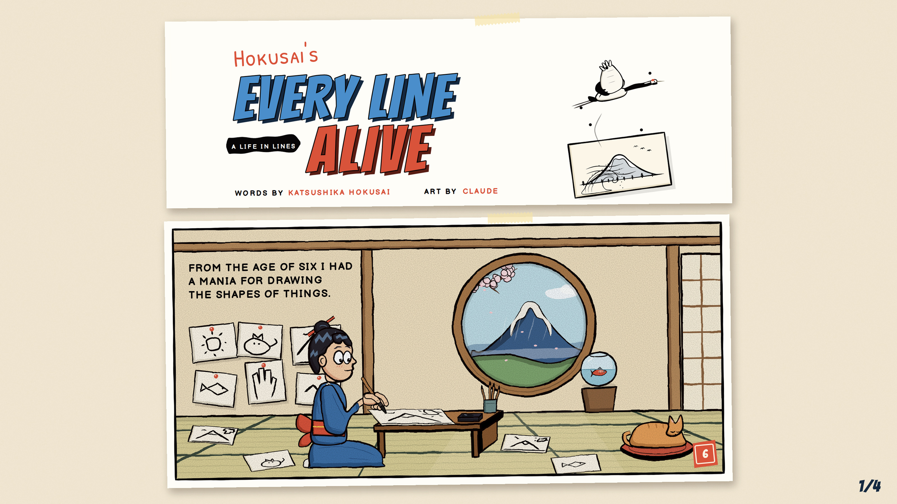
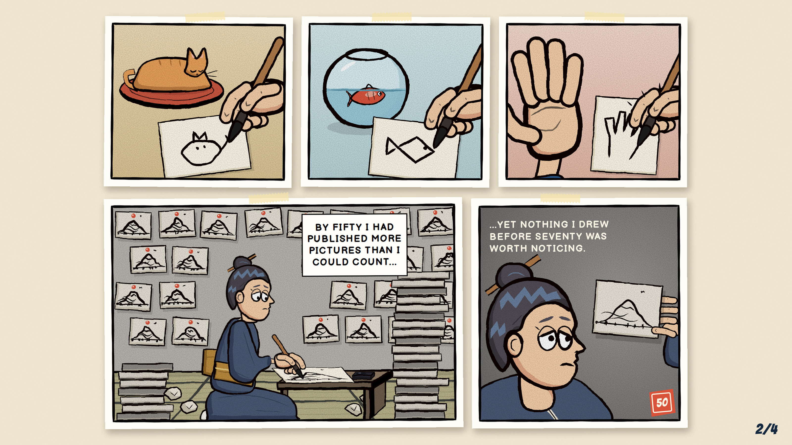
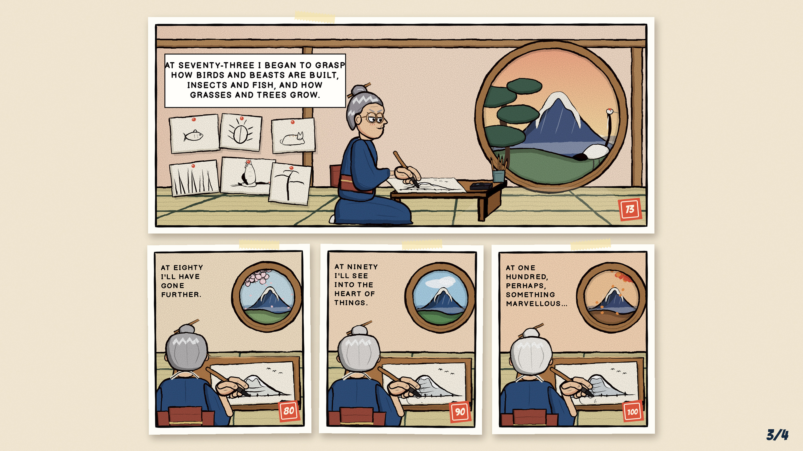
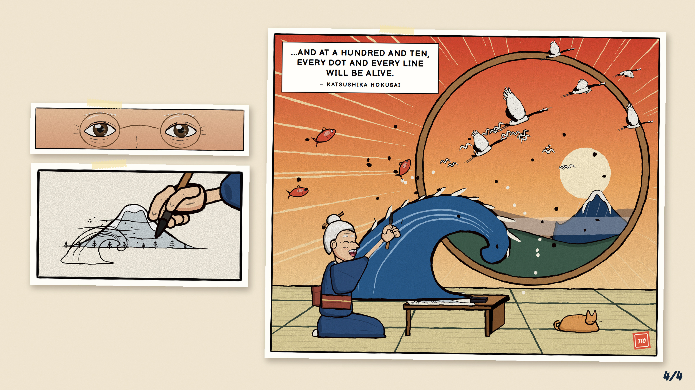

<sub>The same comic as <a href="out/every-line-alive.png">one full page</a> and
<a href="out/every-line-alive/">panel by panel</a>. The four images above are sized to post together on X.</sub>

## Five more comics

Every Line Alive was drawn from close reading alone. These five were **built afterwards, with further research
into how comics work**: the Zen Pencils archive measured with code, a panel reproduced one-to-one, a new
drawing engine built around what that showed, and two rounds of independent audits (all described below).

<table>
  <tr>
    <td width="33%" align="center"><a href="out/up-hill.png">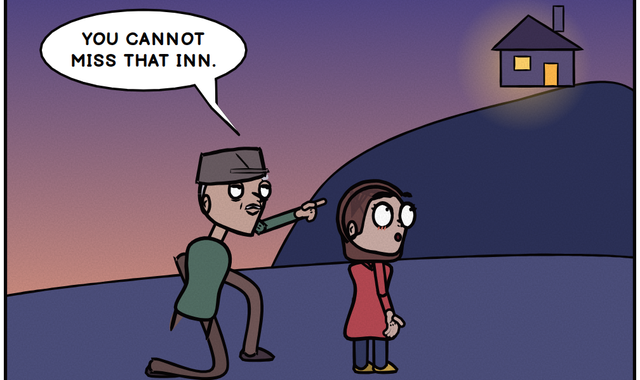</a><br><b>Up-Hill</b><br><sub>Christina Rossetti, 1862</sub></td>
    <td width="33%" align="center"><a href="out/the-great-ocean.png">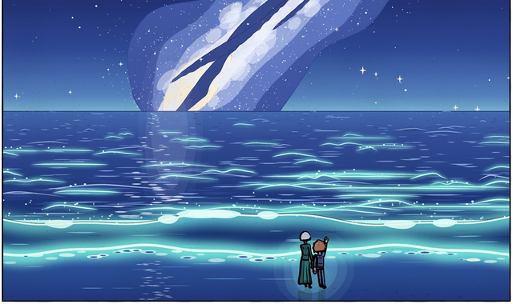</a><br><b>The Great Ocean</b><br><sub>Isaac Newton, as reported</sub></td>
    <td width="33%" align="center"><a href="out/the-butterfly.png">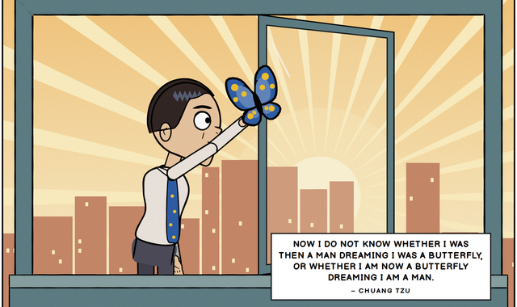</a><br><b>The Butterfly</b><br><sub>Chuang Tzu, tr. H. A. Giles 1889</sub></td>
  </tr>
  <tr>
    <td width="33%" align="center"><a href="out/several-thousand-things.png">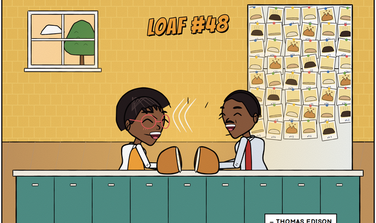</a><br><b>Several Thousand Things</b><br><sub>Thomas Edison, 1910</sub></td>
    <td width="33%" align="center"><a href="out/wobbling-will.png">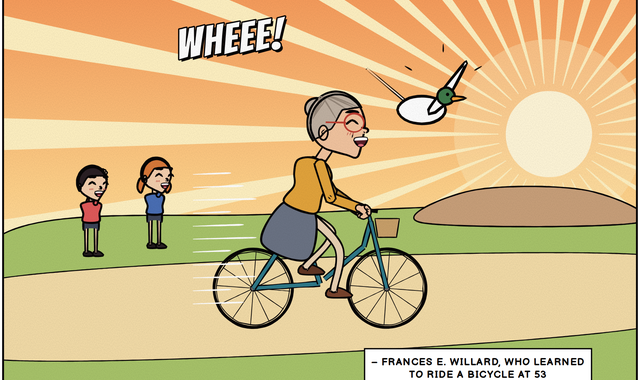</a><br><b>Wobbling Will</b><br><sub>Frances E. Willard, 1895</sub></td>
    <td width="33%"></td>
  </tr>
</table>

<sub>Click a cover for the full page.</sub>

| Comic | The story | The turn |
|---|---|---|
| **Up-Hill** | A six-year-old and her grandad climb one hill from dawn to night. The poem is already a conversation, so she asks and he answers. | He carries her up the last steps, and the inn door opens on everyone who went before. |
| **The Great Ocean** | A famous physicist slips out of her own award dinner, barefoot, to the beach at night. | She kneels beside a small boy turning over shells, and becomes a tiny figure in front of a vast glowing sea. |
| **The Butterfly** | An office worker falls asleep at his desk at 3:07 a.m., and the butterfly lifting off his back has the pattern of his tie. | He wakes with wing dust on his fingertips. |
| **Several Thousand Things** | A girl bakes her Nana's loaf again and again, pinning a photo of every failure to the fridge. | Her dad sees 47 failures. The notes under the photos say it's a lab notebook. |
| **Wobbling Will** | A 53-year-old school cook buys a second-hand bicycle and falls off it for weeks. | She stops staring at the wobbling front wheel, looks at the bridge ahead, and flies. |

Every quote is public domain and checked word for word against a primary or reliable source. None of these
authors has been adapted by Zen Pencils (all 223 archive pages were checked). Full scripts, with the colour
script and repetition device for each, are in [`docs/SCRIPTS.md`](docs/SCRIPTS.md).

---

## Why this exists

Zen Pencils, by Gavin Aung Than, turns a quote into a short visual story: a character, a struggle, a turn,
and the words landing on the last panel. The question here was simple: **how close can code alone get to a
real cartoonist's style?**

The rule was to answer it with evidence rather than by eye:

1. **Measure** the style across the whole archive instead of describing it.
2. **Reproduce** a real panel one-to-one and see exactly where code falls short.
3. **Build** whatever was missing.
4. **Write and draw** original comics with it.
5. **Audit** every page against real strips, automatically and by independent review, and fix what's found.

## How it works

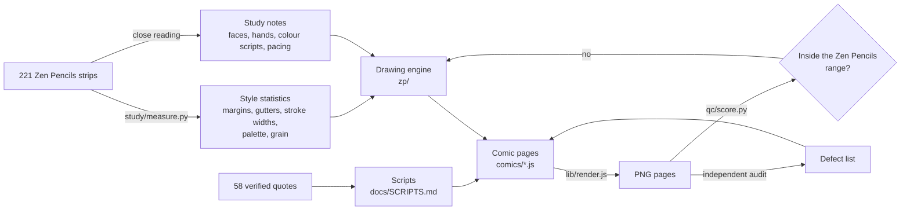

### 1. Measuring the style
[`study/measure.py`](study/measure.py) finds the panels on a page and measures its geometry, ink, colour
and texture. Run over all 221 strips, it produced the target ranges in
[`study/zp_style_stats.json`](study/zp_style_stats.json):

| | Zen Pencils (median) |
|---|---|
| page width / side margins | 980 px / 48 px |
| gutter between panels / between rows | 17 px / 21 px |
| median ink stroke / heavy contour | 2.1 px / 3.2 px |
| dominant hues per strip | 4 (usually 3–5) |

Qualitative findings (colour changes when the feeling changes, repetition shows time passing, faces are
3/4 with the ear far back, brushes are pinched, never fisted) are in [`docs/STUDY.md`](docs/STUDY.md).

### 2. A one-to-one reproduction
A real Zen Pencils panel was redrawn in code and compared side by side. The ink matched the original's
stroke widths to within about 0.2 px; the comparison also showed exactly what the drawing lacked, which drove
the engine rewrite. The reference art is copyrighted, so neither image is in this repo, only the numbers.

### 3. The engine
Everything lives in [`zp/`](zp/), on top of a small brush-stroke toolkit in [`lib/ink.js`](lib/ink.js).

**Heads are projected from 3D**, so one design turns all the way round ([`zp/head.js`](zp/head.js)):

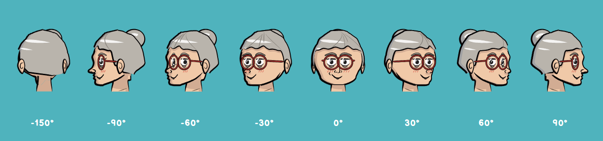

**Faces act** through lids, brows and mouths:

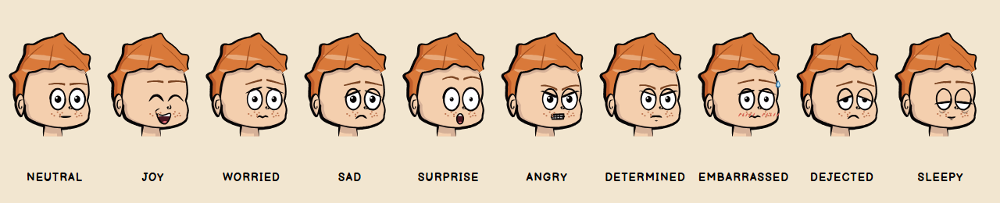

**Figures are rigged**, with inverse kinematics so a hand can reach a point: a handlebar, a sandwich,
another hand ([`zp/figure.js`](zp/figure.js)):

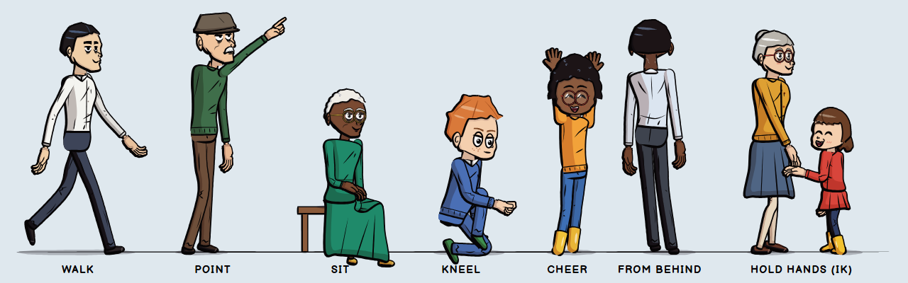

**Hands** are jointed and drawn as one merged silhouette ([`zp/hand.js`](zp/hand.js)):

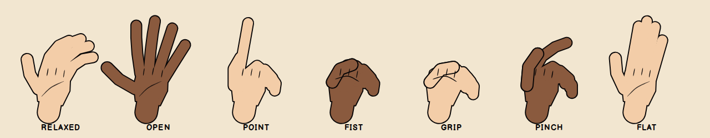

The page layer ([`zp/page.js`](zp/page.js)) uses the measured geometry and draws captions, balloons
(sized from the fonts' real metrics, tails aimed at the speaker), sound effects, rays, glows and paper
grain. Characters take on the scene's light at dusk and night. [`zp/scene.js`](zp/scene.js) draws rooms,
windows, furniture, hills, sea, skylines, clouds and stars.

### 4. Quotes and scripts
[`quotes/quotes.json`](quotes/quotes.json) holds 58 public-domain quotes from 1691 to 1921, about 40% by
women. Each has the source URL it was checked against, a note if the popular wording differs from the
original, a story seed, and a flag for whether Zen Pencils already adapted the author.

### 5. Quality checks
**Automated.** [`qc/score.py`](qc/score.py) measures a rendered page and compares 11 metrics with the
Zen Pencils ranges. Full table: [`docs/QC.md`](docs/QC.md).

| | in the middle 50% of Zen Pencils | in the middle 80% | outside |
|---|---|---|---|
| Up-Hill | 9 | 1 | 1 (brightness) |
| The Great Ocean | 8 | 2 | 1 (brightness) |
| The Butterfly | 11 | 0 | 0 |
| Several Thousand Things | 7 | 4 | 0 |
| Wobbling Will | 7 | 4 | 0 |

**Independent audits.** Two reviews compared every panel with real strips at the same scale, scored each
comic and listed concrete defects: tails pointing at nobody, faces on the backs of heads, floating hands,
props that change between panels. The findings and every fix are in [`docs/AUDITS.md`](docs/AUDITS.md).

---

## What it can do

- **Draw a consistent cast from any angle**, with ten moods, clothes, hair, glasses and props, and hands that grip, point and hold.
- **Pose figures by goal**, not just by angle: point at the inn, take the sandwich, hold the handlebars.
- **Lay out a full vertical strip** with Zen Pencils' measured page geometry, title block, captions,
  balloons and sound effects.
- **Tell time with colour**: characters take on the light of dawn, dusk or night.
- **Score any comic image** against the Zen Pencils style ranges (`npm run qc`).
- **Cut any page into panels** ([`tools/split_panels.py`](tools/split_panels.py)) and lay them out, in
  reading order, as images for sharing ([`tools/share.py`](tools/share.py)).

## Where it falls short

The honest version: **these are not as good as the real thing.** On the last independent review the comics
scored 3–6 out of 10 against real Zen Pencils strips.

- **The measurable style matches; the drawing doesn't.** Margins, gutters, stroke widths and palettes land
  inside Zen Pencils' range. Character drawing, hands and composition do not.
- **Figures are rigs.** They pose correctly but lack the gesture, squash and weight of hand-drawn figures.
- **The line is too even.** There is almost no brush taper or feathering inside forms.
- **Backgrounds are procedural.** Trees, flowers, waves and crowds are repeated shapes, not designed scenes.
- **Every panel is placed by hand.** Positions, angles and reach targets are written in code; there is no
  scene language or automatic staging.
- **Two pages are darker than Zen Pencils usually is.** Up-Hill and The Great Ocean end at night by design.

Closing the remaining gap is mostly panel-by-panel craft, not more tooling.

---

## Quick start

Needs Node 18+ and Python 3.10+.

```sh
npm install && npx playwright install chromium   # headless Chromium renders the SVGs
npm run all                                      # draw the five comics and render them to out/*.png
pip install -r requirements.txt
npm run qc                                       # score them against the Zen Pencils ranges
```

One comic at a time, at double resolution:

```sh
node comics/wobbling.js
node lib/render.js out/wobbling-will.svg out/wobbling-will.png 2
python3 tools/split_panels.py out/wobbling-will.png out/wobbling-will/ --title-height 230
```

Every Line Alive: `node archive/every-line-alive.js`, then `python3 tools/share.py thread` for the four
share images and `python3 tools/share.py banner` for the cover. Engine images: `node docs/readme/make.js`.

## What's where

```
comics/     the five comics, one script each, plus their casts
zp/         the drawing engine: head, figure, hand, page, scene, core
lib/        brush-stroke toolkit, SVG renderer, and the engine behind Every Line Alive
study/      style measurement and the Zen Pencils statistics
qc/         style scorer and QC report
tools/      panel splitter, share images and cover
quotes/     58 verified public-domain quotes
docs/       scripts, study notes, QC table, audit log, README images
out/        rendered pages; Every Line Alive also panel by panel and as four share images
archive/    the scripts for Every Line Alive and The Voice Within, drawn with lib/
fonts/      Bangers, Balsamiq Sans, Patrick Hand (SIL Open Font License)
```

## How it got here

The project started loose and got stricter:

1. **The Voice Within** (Van Gogh) was drawn before studying the archive. It turned out to closely echo an
   existing Zen Pencils strip, so it was set aside ([`out/archive/`](out/archive/)).
2. **Every Line Alive** (Hokusai) came after reading all 221 strips as contact sheets. It was rebuilt twice
   after side-by-side comparisons exposed the figures, faces and hands. It is the main comic here.
3. **The five comics** were built with further research: measuring the style with code, reproducing a
   panel one-to-one, rebuilding the engine around what that showed, and two rounds of independent audits.

## Credits

A homage to [Zen Pencils](https://www.zenpencils.com/) by Gavin Aung Than, whose work this studies closely
and does not reproduce: the stories, characters and art here are original, and only statistics measured
from his strips are included. Quotes are in the public domain. Fonts are under the SIL Open Font License.
