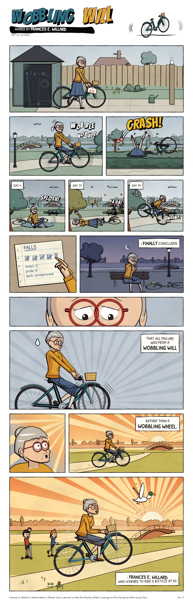

# Comics in Code

Five short inspirational comics in the style of [Zen Pencils](https://www.zenpencils.com/), the
webcomic by Gavin Aung Than that turns a quote or poem into a short visual story. Every line, colour
and letter is generated by JavaScript: there are no image assets, only open-licence fonts.



## The aim

The goal was to see how close code alone could get to a real cartoonist's style, and to do it
rigorously rather than by eye:

1. **Reverse-engineer** the Zen Pencils style: measure it, not just describe it.
2. **Reproduce** a real panel one-to-one and compare it side by side.
3. **Build** whatever drawing capability the comparison showed was missing.
4. **Write and draw** original comics with that engine, using verified public-domain quotes.
5. **Audit** every comic, with automated checks and independent reviews against real strips, and fix what they find.

## The comics

| | Comic | Words | Story |
|---|---|---|---|
| 1 | [Up-Hill](out/up-hill.png) | Christina Rossetti, 1862 | A small girl and her grandad climb one hill from dawn to night; the poem's questions and answers are split between them. |
| 2 | [The Great Ocean](out/the-great-ocean.png) | Isaac Newton (reported) | A famous physicist slips out of her own award dinner to hunt shells on a night beach with a small boy. |
| 3 | [The Butterfly](out/the-butterfly.png) | Chuang Tzu, tr. H. A. Giles, 1889 | An office worker falls asleep at 3 a.m., becomes a butterfly, and wakes with wing dust on his fingers. |
| 4 | [Several Thousand Things](out/several-thousand-things.png) | Thomas Edison, 1910 | A girl bakes her Nana's loaf 48 times, pinning a photo of every failure to the fridge. |
| 5 | [Wobbling Will](out/wobbling-will.png) | Frances E. Willard, 1895 | A 53-year-old keeps falling off her bicycle until she stops staring at the wheel. |

Each script, with its colour script, repetition device and turn, is in [`docs/SCRIPTS.md`](docs/SCRIPTS.md).

### Every Line Alive (Hokusai)

[`out/every-line-alive.png`](out/every-line-alive.png), with every panel as its own image in
[`out/every-line-alive/`](out/every-line-alive/) (rendered at 2x).

Hokusai's afterword to *One Hundred Views of Mount Fuji* (1834), condensed in my own words: he drew from
the age of six, thought nothing he made before seventy was worth noticing, and hoped that at 110 "every
dot and every line will be alive." One artist, one round window, one mountain, from age 6 to 110.
- **The drawing on her desk is generated with a `skill` parameter (0 to 1)**, so it really improves
  with age: a lopsided triangle at 6, mist and pines in middle age, a snow cap at 90, a wave at 100.
- **Repetition:** the same over-the-shoulder frame at 80, 90 and 100; only the season, her hair and the
  drawing change.
- **Finale:** a nod to Hokusai's *Great Wave*: the wave rises off her paper, and cranes fly out through the window.

It was drawn before the measurement-first engine, with its own figure, face and hand code (`lib/artist.js`,
`lib/face.js`, `lib/hands.js`, `lib/hoku.js`). Rebuild it with `node archive/every-line-alive.js`.
None of these authors has been adapted by Zen Pencils (all 223 archive pages were checked).

## How it was done

### 1. Measuring the style
`study/measure.py` takes a strip image and measures:
- page margins, gutters, panel borders and panel widths
- ink stroke widths (skeleton length vs dark area, per tile)
- saturation, brightness and number of dominant hues
- grain in flat colour

`study/measure_all.py` ran it over all 221 Zen Pencils strips. The distributions are saved in
`study/zp_style_stats.json`. Some findings:
- Pages are 980 px wide with 48 px margins, 17 px gutters between side-by-side panels and 21 px between rows.
- The median ink stroke is 2.1 px and heavy contours are about 3.2 px.
- Palettes are small: usually 3 to 5 dominant hues.

The qualitative notes (colour scripts, repetition, pacing, how faces and hands are built) are in
[`docs/STUDY.md`](docs/STUDY.md).

### 2. A one-to-one reproduction
A real Zen Pencils panel was redrawn in code and compared side by side. The reproduction's
stroke widths matched the original to within about 0.2 px. The comparison also showed what was missing,
which drove the engine rewrite. The original art is copyrighted, so neither the reference nor the
reproduction is in this repo.

### 3. The engine (`zp/`)
- **`head.js`**: heads are projected from a 3D model, so one character design turns from front to
  profile to back. It handles hairlines that wrap the head, ponytails, pigtails, buns, long hair,
  a flat cap, glasses, and moods (joy, sad, worried, shock, focus, tired…).
- **`figure.js`**: a posable figure rig in Zen Pencils proportions (about 3.5 heads tall for adults)
  with two-bone IK for arms and legs. Hands reach targets such as handlebars, a sandwich or another
  hand. It also handles sitting and kneeling, coats, dresses, skirts and trousers, ambient tinting
  for dusk and night, and silhouettes.
- **`hand.js`**: jointed hands in seven poses, drawn as one merged silhouette.
- **`page.js`**: page geometry taken from the measurements. It also draws panels with grain,
  captions, balloons sized from real font metrics with tails that reach the speaker, sound effects,
  rays and warm glows.
- **`scene.js`**: rooms, windows, furniture, hills, sea, skylines, clouds and stars.
- **`core.js`**: ink primitives at constant, measured line weights.

`lib/ink.js` is the low-level brush-stroke toolkit underneath, and `lib/render.js` rasterises the
SVGs with headless Chromium.

### 4. Quotes
[`quotes/quotes.json`](quotes/quotes.json) holds 58 public-domain quotes. Each has its wording checked
against a primary or reliable source (with the URL), a story seed, and a flag for whether Zen Pencils
has already adapted the author. See [`quotes/README.md`](quotes/README.md).

### 5. Quality checks
- **Automated:** `qc/score.py` measures a rendered comic and compares every metric with the
  Zen Pencils distribution. The results for all five comics are in [`docs/QC.md`](docs/QC.md).
- **Independent audits:** two reviews compared every panel with real strips and listed concrete defects.
  Scores, fixes and remaining gaps are in [`docs/AUDITS.md`](docs/AUDITS.md).

## What it can do

- Draw a consistent cast from any angle and in many poses, with expressions, clothing and props,
  in a flat-colour ink style whose measurable properties match Zen Pencils.
- Lay out full-length vertical strips with Zen Pencils' measured page geometry, captions, balloons,
  sound effects and a title block.
- Let a scene change light across the page (dawn, noon, dusk, night) by tinting characters to match.
- Score any comic image against the Zen Pencils style distributions.

## Current limitations

- **It doesn't match Zen Pencils yet.** On the last independent review, the five comics scored 3–6
  out of 10 against real strips across character drawing, hands, backgrounds, composition and finish.
  The spacing, line weights and palette sizes match; the drawing itself does not.
- **Figures are rigs.** Limbs are capsules on a skeleton. They pose correctly but lack the gesture,
  squash and weight of hand-drawn figures.
- **The line is too even.** Stroke width barely varies, with no brush taper or feathering inside forms.
- **Backgrounds are procedural.** Trees, flowers, waves and crowds are repeated shapes rather than
  designed scenes.
- **Poses are placed by hand.** Each panel sets positions, angles and IK targets in code. There is no
  scene description language or automatic layout.
- **Two comics fail the brightness check.** Up-Hill and The Great Ocean are darker than 90% of Zen
  Pencils strips because their colour scripts end at night.
- **The measurement data came from copyrighted strips.** Only the derived statistics are published,
  not the images.

## Build it

Requirements: Node 18+ and Python 3.10+.

```sh
npm install                     # Playwright, for rendering
npx playwright install chromium
npm run all                     # draw the five comics (SVG) and render them to PNG in out/
pip install -r requirements.txt
npm run qc                      # style check against the Zen Pencils measurements
python3 qc/report.py            # rewrite docs/QC.md
```

To draw one comic: `node comics/uphill.js`, then `node lib/render.js out/up-hill.svg out/up-hill.png 2`
(the final argument is the pixel scale). To cut a page into panels:
`python3 tools/split_panels.py out/up-hill.png out/up-hill/ --title-height 250`.

## Layout

```
comics/    the five comics (one script each) and their casts
zp/        the drawing engine
lib/       brush-stroke toolkit, SVG renderer, and helpers used by the earlier attempts
study/     style measurement scripts and the measured Zen Pencils statistics
qc/        style scorer and QC report
tools/     split_panels.py: cut any rendered page into one image per panel
quotes/    the verified quote repository
docs/      scripts, study notes, QC table and audit log
out/       rendered comics; out/every-line-alive/ has that comic panel by panel; out/archive/ the first attempt
archive/   earlier attempts: "The Voice Within" (Van Gogh) and "Every Line Alive" (Hokusai)
fonts/     open-licence fonts (SIL OFL)
```

## Earlier attempts

The project began with two looser attempts, whose scripts are in `archive/`:
- **The Voice Within** (Van Gogh): drawn before studying the archive. It turned out to closely echo an
  existing Zen Pencils strip, so it was set aside.
- **Every Line Alive** (Hokusai): see above.

The shortcomings of these two led to the measurement-first approach above.

## Credits

A homage to Zen Pencils by Gavin Aung Than. The stories, characters and art here are original.
The quotes are in the public domain. Fonts are SIL Open Font License.
